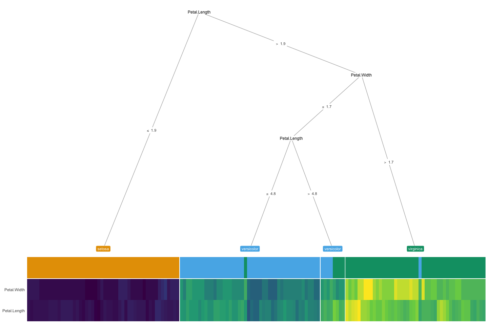
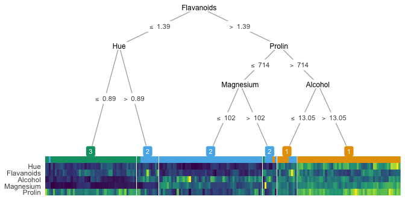

treeheatr
================

Integrating heatmap in decision tree.

## Install

``` r
devtools::install_github('trang1618/treeheatr',
                         dependencies = TRUE)
```

## Examples

### Iris dataset

Classification of different types of iris plants.

``` r
library(treeheatr)

heat_tree(iris, class_lab = 'Species') %>% 
  grid.draw()
```

<!-- -->

### Wine recognition dataset from the Penn ML Benchmarks ([PMLB](https://github.com/EpistasisLab/penn-ml-benchmarks))

Classification of different cultivars of wine.

``` r
library(pmlblite)
dataset_name <- 'wine-recognition'
feat_names <- c('Alcohol', 'Malic acid', 'Ash', 'Alcalinity of ash', 'Magnesium', 
                'Total phenols', 'Flavanoids', 'Nonflavanoid phenols', 'Proanthocyanins',
                'Color intensity', 'Hue', 'OD280/OD315 of diluted wines', 'Prolin')
dat_raw <- fetch_data(dataset_name)
colnames(dat_raw)[2:14] <- feat_names

heat_tree(dat_raw, class_lab = 'target') %>% 
  grid.draw()
```

<!-- -->

## How to Use

**treeheatr** incorporates a heatmap at the terminal node of your
decision tree. The basic building blocks to a **treeheatr** plot are
(yes, you guessed it\!) a decision tree and a heatmap.

  - The decision tree is computed with `partkit::ctree()` and plotted
    with the well-documented and flexible
    [**ggparty**](https://cran.r-project.org/web/packages/ggparty/index.html)
    package. The tree parameters can be passed to **ggparty** functions
    via the `heat_tree()` and `draw_tree()` functions of **treeheatr**.
    More details on different **ggparty** *geoms* can be found
    [here](https://github.com/martin-borkovec/ggparty).

  - The heatmap is shown with `ggplot2::geom_tile()`. The user may
    choose to cluster the samples within each leaf node or the features
    across all samples.

Make sure to check out the
[*wiki*](https://github.com/trang1618/treeheatr/wiki) or the
[vignettes](https://github.com/trang1618/treeheatr/vignettes) for
detailed information on the usage of **treeheatr**.

Please [open an
issue](https://github.com/trang1618/treeheatr/issues/new) for questions
related to **treeheatr** usage, bug reports or general inquiries. Thank
you very much for your support\!
