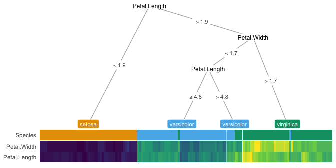

**treeheatr**: an introduction
================

[](https://trang1618.github.io/treeheatr/articles/explore.html/)
[](https://trang1618.github.io/treeheatr/reference/)
[](https://github.com/trang1618/treeheatr/actions)

#### *Your decision tree may be cool, but what if I tell you you can make it hot?*

## Install

Please make sure your version of R \>= 3.5.0 before installation.

``` r
# install.packages('devtools') # uncomment to install devtools
devtools::install_github('trang1618/treeheatr')
```

## Examples

### Iris dataset

Classification of different types of iris plants.

``` r
library(treeheatr)

grid.draw(heat_tree(iris, target_lab = 'Species'))
```

<!-- -->

### Wine recognition dataset

Classification of different cultivars of wine.

``` r
grid.draw(heat_tree(wine, target_lab = 'Type', target_lab_disp = 'Cultivar'))
```

<!-- -->

## How to Use

**treeheatr** incorporates a heatmap at the terminal node of your
decision tree. The basic building blocks to a **treeheatr** plot are
(yes, you guessed it\!) a decision tree and a heatmap.

  - The decision tree is computed with `partykit::ctree()` and plotted
    with the well-documented and flexible
    [**ggparty**](https://cran.r-project.org/web/packages/ggparty/index.html)
    package. The tree parameters can be passed to **ggparty** functions
    via the `heat_tree()` and `draw_tree()` functions of **treeheatr**.
    More details on different **ggparty** *geoms* can be found
    [here](https://github.com/martin-borkovec/ggparty).

  - The heatmap is shown with `ggplot2::geom_tile()`. The user may
    choose to cluster the samples within each leaf node or the features
    across all samples.

Make sure to check out the
[vignette](https://trang1618.github.io/treeheatr/articles/explore.html)
for detailed information on the usage of **treeheatr**.

Please [open an
issue](https://github.com/trang1618/treeheatr/issues/new) for questions
related to **treeheatr** usage, bug reports or general inquiries.

Thank you very much for your support\!
