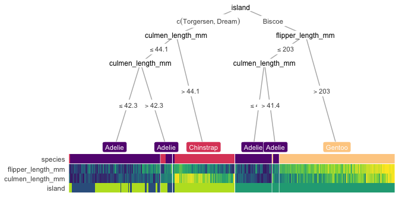
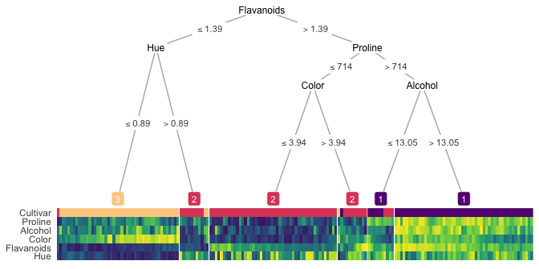

[](https://trangdata.github.io/treeheatr/articles/explore.html)
[](https://trangdata.github.io/treeheatr/reference/)

[](https://cran.r-project.org/package=treeheatr)
[](https://doi.org/10.1093/bioinformatics/btaa662)

# treeheatr 

*Your decision tree may be cool, but what if I tell you you can make it
hot?*

## Changes in treeheatr 0.2.0

The first argument of `heat_tree()`, `data` is now replaced with `x`,
which can be a dataframe (or tibble), a party (or constparty) object
specifying the precomputed tree, or partynode object specifying the
customized tree. `custom_tree` argument is no longer needed.

## Install

Please make sure your version of R \>= 3.5.0 before installation.

You can install the released version of **treeheatr** from CRAN with:

``` r
install.packages('treeheatr')
```

Or the development version from GitHub with remotes:

``` r
# install.packages('remotes') # uncomment to install devtools
remotes::install_github('trangdata/treeheatr')
```

## Examples

### Penguin dataset

These data were collected and made available by [Dr. Kristen
Gorman](https://www.uaf.edu/cfos/people/faculty/detail/kristen-gorman.php)
and the [Palmer Station, Antarctica
LTER](https://pallter.marine.rutgers.edu/).

Classification of different types of penguin species.

``` r
library(treeheatr)

heat_tree(penguins, target_lab = 'species')
```

<!-- -->

### Wine recognition dataset

Classification of different cultivars of wine.

``` r
heat_tree(wine, target_lab = 'Type', target_lab_disp = 'Cultivar')
```

    ## Warning in (function (mapping = NULL, nudge_x = 0, nudge_y = 0, ids = NULL, :
    ## Ignoring unknown parameters: `label.size`

<!-- -->

## Citing treeheatr

If you use treeheatr in a scientific publication, please consider citing
the following paper:

Le TT, Moore JH. [treeheatr: an R package for interpretable decision
tree visualizations](https://doi.org/10.1093/bioinformatics/btaa662).
*Bioinformatics*. 2020 Jan 1.

BibTeX entry:

``` bibtex
@article{le2020treeheatr,
  title={treeheatr: an R package for interpretable decision tree visualizations},
  author={Le, Trang T and Moore, Jason H},
  journal={Bioinformatics},
  year={2020},
  doi="10.1093/bioinformatics/btaa662"
}
```

## How to Use

**treeheatr** incorporates a heatmap at the terminal node of your
decision tree. The basic building blocks to a **treeheatr** plot are
(yes, you guessed it!) a decision tree and a heatmap.

- The decision tree is computed with `partykit::ctree()` and plotted
  with the well-documented and flexible
  [**ggparty**](https://cran.r-project.org/package=ggparty/) package.
  The tree parameters can be passed to **ggparty** functions via the
  `heat_tree()` and `draw_tree()` functions of **treeheatr**. More
  details on different **ggparty** *geoms* can be found
  [here](https://github.com/martin-borkovec/ggparty).

- The heatmap is shown with `ggplot2::geom_tile()`. The user may choose
  to cluster the samples within each leaf node or the features across
  all samples.

Make sure to check out the
[vignette](https://trangdata.github.io/treeheatr/articles/explore.html)
for detailed information on the usage of **treeheatr**.

Please [open an
issue](https://github.com/trangdata/treeheatr/issues/new) for questions
related to **treeheatr** usage, bug reports or general inquiries.

Thank you very much for your support!

## Acknowledgements

Package hex was made with [Midjourney](https://www.midjourney.com/home/)
and thus inherits a [CC BY-NC 4.0
license](https://creativecommons.org/licenses/by-nc/4.0/legalcode).
